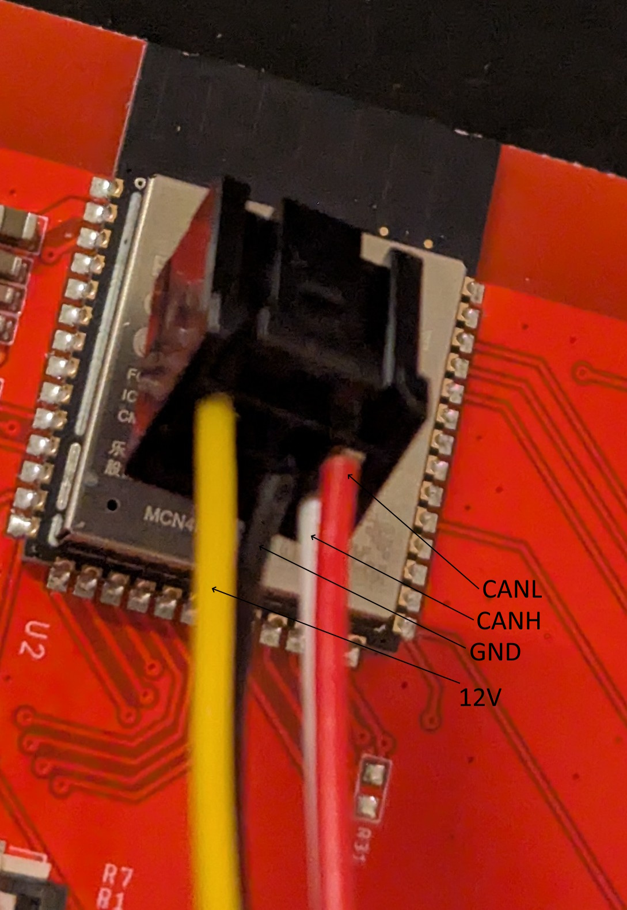

# Mitsubishi i-MiEV BMS viewer — CrowPanel 5" v3.0 (PlatformIO)

> ⚠️ **Work in progress.** This project is under active development and
> has not yet been fully validated on a complete i-MiEV pack across both
> bus modes. Pin assignments, byte layouts, decoding formulas, and on-
> screen values **may contain errors**. Cross-check anything you act on
> (especially before connecting to a live HV pack or relying on
> readings for diagnostics) against the linked upstream sources
> (SimpBMS / `ImievBMSV2`, `c-zero_dashboard`, the myimiev forum
> threads cited below). Pull requests and corrections welcome.

A standalone CAN listener + display for snooping the BMU/CMU broadcasts on
a Mitsubishi i-MiEV (and clones: Peugeot iOn, Citroën C-Zero) battery pack.
Runs on the **Elecrow CrowPanel 5-inch v3.0** ESP32-S3 HMI (800×480 RGB,
GT911 touch) with **LVGL 9.2**, **LovyanGFX 1.2**, and **Arduino-ESP32
2.0.14** under PlatformIO.

Two modes, picked at boot from a 5-second selection screen:

- **CMU bus mode** — plugged into the BMU's internal bus
  (IDs `0x611..0x6C4`). Shows one CMU at a time with all 8 cell
  voltages, 6 temperatures, and the balancing bitmask.
  Auto-follows whichever CMU is currently broadcasting, or tap the
  on-screen arrows for manual navigation (locks the view for 5 s,
  then resumes auto-follow).
- **OBD2 mode** — plugged into the car's OBD2 / CAR-CAN bus
  (IDs `0x373`, `0x374`, `0x6E1..0x6E4`). Pack-level dashboard with
  SoC, pack V/A, instant power in kW, min/max cell voltage and delta,
  and max module temperature.

If you don't touch the selection screen for 5 s, CMU bus mode is selected
automatically.

## What's in here

```
crowpanel5/
├── platformio.ini                  # build config (toolchain pinned)
├── README.md                       # this file
├── include/
│   ├── LGFX_CrowPanel5.hpp         # panel + GT911 touch config (v3.0)
│   └── lv_conf.h                   # LVGL config (committed; no template copy needed)
└── src/
    └── main.cpp                    # TWAI driver + BMS decode + LVGL UI
```

## Hardware you need

| Item | Notes |
|---|---|
| Elecrow CrowPanel 5" **v3.0** | Older revisions use different touch wiring — see "v3.0 specifics" below |
| CAN transceiver | Either a native 3.3 V part (SN65HVD230, MCP2562FD, ISO1042) **or** a TJA1050 module with a **voltage divider on the RX line** — see note below |
| 12 V bench supply or SLA | To wake the BMU when using CMU bus mode. Plan for ~300 mA headroom |
| 8-pin connector to BMU | CMU bus mode only. Pin 1 CAN-L, pin 4 +12 V, pin 5 CAN-H, pin 6 GND |
| OBD2 cable | OBD2 mode only. CAN-H on pin 6, CAN-L on pin 14 |

### Note on TJA1050 modules

The cheap NXP TJA1050 boards on AliExpress / eBay are **5 V parts**:
they run from VCC = 5 V and their `RXD` line swings 0–5 V. The
ESP32-S3 GPIOs are **not** 5 V-tolerant — wiring `RXD` straight to
`GPIO 13` will eventually damage the input pin, even if it appears
to "work" at first.

The fix is a resistor divider on the `RXD` line that drops 5 V to
~3.3 V before it reaches the ESP. Typical values:

```
  TJA1050 RXD ──┬─────  R1 (1.8 kΩ)  ─────┬──→ ESP32-S3 GPIO 13
                │                          │
                └─ open ─┐                R2 (3.3 kΩ)
                                            │
                                          GND
```

`R2 / (R1 + R2) ≈ 0.65`, so 5 V → ~3.25 V at the ESP pin. The TX
side (`GPIO 10` → TJA1050 `TXD`) does **not** need a divider —
the TJA1050's input threshold treats 3.3 V as a valid logic-high.
Run TJA1050 VCC from 5 V (USB-VBUS on the CrowPanel works), keep
grounds tied together with the BMU/OBD2 cable shield.

See [documentation/Board-Modifications.jpg](documentation/Board-Modifications.jpg)
for a photo of the modification on a TJA1050 breakout (here a simple series resistor was used with 1.5k, which works, but is not a good solution)).

Transceiver wiring to the ESP32-S3:

| Transceiver | ESP32-S3 |
|---|---|
| CTX  (TX into transceiver) | **GPIO 10** |
| CRX  (RX out of transceiver) | **GPIO 13** |
| VCC | 3V3 from the CrowPanel |
| GND | GND from the CrowPanel **and** from the i-MiEV bus, tied together |
| CAN-H / CAN-L | BMU pins 5 / 1  **or**  OBD2 pins 6 / 14 |

The same transceiver pins serve both modes — you just plug into whichever
bus you want to listen to and pick the matching mode at startup. Both
buses run at 500 kbps.

Both the BMU bus and the OBD2 bus are already terminated at both ends;
**do not add a 120 Ω terminator** unless you're snooping outside the
car with the BMU as the only other node.

Pinout of the BMU's 8-pin connector (CMU bus mode):
https://eu.mouser.com/ProductDetail/JST-Automotive/SCPT-A021GF-0.5?qs=XoGB3caz5%2FZLgel%252BRalypQ%3D%3D
https://eu.mouser.com/ProductDetail/JST-Automotive/08CPT-B-2A?qs=XoGB3caz5%2Facp4rQg5u%2F9w%3D%3D


## First-time setup

### 1. Tools (Windows)
- **VS Code** + **PlatformIO IDE** extension.
- **Silicon Labs CP210x VCP** driver so the board enumerates as a COM port.

### 2. Open & build
1. `File → Open Folder…` and pick this directory.
2. PlatformIO downloads the toolchain and libs (`espressif32@6.7.0`,
   `lvgl@^9.2.2`, `LovyanGFX@^1.2.0`). First run takes a few minutes.
3. **Build** (✓) → **Upload** (→) on the PlatformIO toolbar.
4. Open **Serial Monitor** (🔌, 115200 baud). On boot you should see:
   ```
   CrowPanel 5 v3.0 / LVGL 9 / i-MiEV BMS viewer booting...
   I2C scan: 0x19 0x5D  (2 devices)
   Ready.
   ```
   `0x19` is the PCA9557 I/O expander; `0x5D` is the GT911 after reset.
   If you only see `0x19`, touch latched the wrong I²C address — see the
   gotchas table.
5. The display shows the **mode selection screen**: a green "CMU Bus"
   button on the left, a navy "OBD2" button on the right, and a
   countdown at the bottom. Tap one or wait 5 s (defaults to CMU bus).
   After you commit, the serial monitor prints the chosen mode and:
   ```
   Mode: CMU bus  (BMU IDs 0x611-0x6C4)
   CAN: 500 kbps  TX=GPIO10  RX=GPIO13
   ```

### 3. Try it without a CAN bus — test mode
At the top of [`src/main.cpp`](src/main.cpp):

```c
#define BMS_TEST_MODE 1   // 0 = real CAN, 1 = synthetic frames
```

With `BMS_TEST_MODE = 1`, the firmware skips TWAI init and runs an
internal task that feeds plausible-looking frames through the real
decoder. The test task waits for you to pick a mode at boot, then
synthesizes the matching frame type:

- **CMU mode test data:** cycles through all 12 CMUs every ~4 s,
  baseline cells ~3.95 V with a few deliberately out-of-range cells so
  every color is exercised, balancing toggles on CMUs 2 and 5 every 4 s.
  CMUs 11 and 12 are treated as 4-cell modules per spec so cells 5–8
  stay grey. The title shows `CMU N  [TEST]`.
- **OBD2 mode test data:** pack voltage oscillates around 345 V,
  current ±18 A, SoC drifting around 87.5 %, plus a full
  `0x6E1..0x6E4` cell stream. The title shows `OBD2 Pack  [TEST]`.

## UI tour

### Mode selection (boot screen)

```
┌──────────────────────────────────────────────────────┐
│              i-MiEV BMS viewer                       │
│              Select data source                      │
│                                                      │
│      ┌───────────────┐    ┌───────────────┐          │
│      │   CMU Bus     │    │     OBD2      │          │
│      │ per-CMU detail│    │ pack dashboard│          │
│      │   (default)   │    │               │          │
│      └───────────────┘    └───────────────┘          │
│                                                      │
│           CMU bus selected in 3 s...                 │
└──────────────────────────────────────────────────────┘
```

Tap a button or wait for the timer. The choice is committed for the
rest of the session — to switch modes, reboot.

### CMU bus mode

```
┌──────────────────────────────────────────────────────┐
│ CMU 4                                          AUTO  │   <- montserrat_28 / badge
│ Pack: min 3.92 V  max 4.01 V  avg 3.96 V  delta 90 mV│   <- unscii_16 (bitmap, no AA)
│                                                      │
│ Cell 1:  3.951 V        T1:  21 C                    │
│ Cell 2:  3.948 V        T2:  22 C                    │
│ Cell 3:  3.952 V  BAL   T3:  21 C                    │
│ Cell 4:  3.961 V        T4:  23 C                    │
│ Cell 5:  3.955 V        T5:  22 C                    │
│ Cell 6:  3.949 V        T6:  24 C                    │
│ Cell 7:  3.962 V                                     │
│ Cell 8:  3.945 V        Balance: 3                   │
│                                                      │
│ CMU 4: last frame 87 ms ago (fresh)                  │
│ frames this CMU: 1240    pack frames: 14882          │
│                                                      │
│  [   <   ]                            [   >   ]      │
└──────────────────────────────────────────────────────┘
```

| Cell color | Meaning |
|---|---|
| Dark green | Healthy cell (3.30 V – 4.05 V, not balancing) |
| Navy | Balancing — bleed resistor active |
| Dark amber | Near top of charge (4.05 – 4.15 V) |
| Dark red | Out of range (< 3.30 V or > 4.15 V) |
| Light grey | No data yet for that cell / sensor |

The badge top-right is **green AUTO** when auto-follow is engaged
(latest CMU on screen) and **blue MANUAL** when you've tapped a nav
button (locks the view for 5 s, then resumes auto).

### OBD2 mode

```
┌──────────────────────────────────────────────────────┐
│ OBD2 Pack                                     FRESH  │
│                                                      │
│                                                      │
│      87.5 %               -4.25 kW                   │   <- montserrat_42
│      State of Charge      Power (- discharge ...)    │
│                                                      │
│  Pack:       345.6 V       Cell max:   4.09 V        │   <- unscii_16
│  Current:    -12.3 A       Cell min:   3.92 V        │
│  Temp:       18..26 C      Delta:       170 mV       │
│                                                      │
│  last frame 87 ms ago (fresh)   pack frames: 12440   │
└──────────────────────────────────────────────────────┘
```

| Element | Meaning / source |
|---|---|
| Top-right badge | **NO DATA** (grey) → **FRESH** (green, < 2 s old) → **STALE** (red, ≥ 2 s old) |
| SoC hero | `0x374` — average of SoC1 and SoC2 |
| Power hero color | Dark green when charging (kW > 0), navy when discharging (kW < 0), grey near zero |
| Pack V / Current A | `0x373` bytes 4–5 and 2–3 |
| Cell max / min | `0x373` bytes 0 and 1 (note: different encoding than per-cell `0x6E1..0x6E4`) |
| Delta | computed `(cell_max − cell_min) × 1000` mV |
| Temp | Per-sensor min..max scanned across `g_cmu[].temp_c[]` (sensors fed by `0x6E1..0x6E4`). Falls back to `Temp max: N C` from `0x374` byte 4 if no sensor stream has arrived yet |

OBD2 mode has no navigation buttons — it's a single fixed dashboard.
The per-CMU cell data from `0x6E1..0x6E4` is decoded into the same
`g_cmu[]` store but not currently displayed in this view.

## Why these specific versions?

- `platform = espressif32@6.7.0` pins Arduino-ESP32 to **2.0.14**.
  LovyanGFX 1.2's RGB-panel driver currently does **not** build cleanly
  against the 3.x core because `esp_lcd_*` APIs were rearranged.
- `lvgl @ ^9.2.2` is the most recent 9.x line that's been thoroughly
  shaken out on ESP32-S3. 9.5 (Feb 2026) adds MPU-class features
  (NanoVG, glTF) that don't matter here.
- `LovyanGFX @ ^1.2.0` ships the ESP32-S3 `Panel_RGB` + `Bus_RGB` +
  `Touch_GT911` you need; older 1.1.x versions did not.
- TWAI driver is built into ESP-IDF — no extra `lib_deps` entry.

## v3.0 specifics (touch bring-up)

On the **v3.0** revision, the GT911's `RST` and `INT` lines are not
wired to ESP32 GPIOs — they pass through a **PCA9557 I²C I/O expander**
sharing the same I²C bus as the touch controller. LovyanGFX has no
concept of the expander, so [`crowpanel_v3_touch_bringup()`](src/main.cpp)
in `main.cpp` performs the reset/address-latch sequence manually before
`lcd.init()` runs:

1. PCA9557 `IO0` LOW (assert GT911 RST), `IO1` LOW (forces address `0x5D`)
2. 20 ms delay
3. `IO0` HIGH (release RST while INT is still LOW → GT911 latches `0x5D`)
4. 100 ms delay
5. `IO1` back to input (high-Z) so the GT911 can drive its INT line

LovyanGFX is configured with `pin_rst = -1` and `pin_int = -1` so it
leaves those lines alone afterwards.

If you have an older v1.x or v2.x board where RST/INT *are* on GPIOs 38
and 18, replace `crowpanel_v3_touch_bringup()` with a direct
`pinMode/digitalWrite` reset and put those GPIO numbers back into
`LGFX_CrowPanel5.hpp`.

## Common gotchas

| Symptom | Likely cause |
|---|---|
| Black screen, board boots fine | Wrong `psram_type` — must be `opi` on N4R8 |
| Display works, touch doesn't, `I2C scan` shows only `0x19` | Wrong revision detection — try `PCA9557_ADDR = 0x18` |
| `I2C scan` shows **nothing** | Wrong I²C pins, broken pull-ups, or 400 kHz too fast — try 100 kHz |
| Tearing / wobbly horizontal lines | `freq_write` too high in `LGFX_CrowPanel5.hpp`; drop to 12 MHz |
| Watchdog reset on boot | LVGL draw buffers couldn't allocate — PSRAM not enabled |
| Upload fails, "wrong chip detected" | Hold BOOT, tap RESET, release BOOT, retry upload |
| `twai_driver_install failed` | Pin conflict (10/13 already used) or transceiver not powered |
| All cells show grey `--` despite CAN being up | Bus is alive but BMU asleep — needs `+12 V` on pin 4 to wake (CMU mode); ignition on or charge port active (OBD2 mode) |
| Cells flicker between values and `--` | Transceiver power or ground bounce — recheck wiring |
| Picked OBD2 but cells stay grey | Wrong bus for the chosen mode — CMU mode expects `0x611..0x6C4`, OBD2 mode expects `0x373/0x374/0x6E1..0x6E4`. Reboot and pick the other |
| Selection screen jumps to CMU mode before I can tap | Touch isn't working — see the touch gotchas above; once touch is fixed the 5 s timer behaves correctly |

## Protocol reference

The dispatcher in [`decode_frame()`](src/main.cpp) routes by ID range to
one of four decoders.

### CMU bus (`0x611..0x6C4`) — internal BMU↔CMU traffic
Validated with imiev 2012 BMU 4 cell and 8 cell

- **CAN ID:** `0x600 + (CMU_id × 0x10) + pair_id`, where `CMU_id` is 1–12
  and `pair_id` is 1–4 (cell pairs).
- **Voltage:** `(byte_H << 8 | byte_L) × 0.005 + 2.1` V
- **Temperature:** `raw − 50` °C
- **Balance mask:** byte 1 of frame 1 — bit `i` = cell `i+1` actively
  bleeding.
- **Per-frame byte layout** (verified against the SimpBMS `ImievBMSV2`
  and `c-zero_dashboard` decoders; matches real hardware):

  | Frame | Byte 1 | Byte 2 | Byte 3 |
  |---|---|---|---|
  | 1 (cells 1, 2) | balance mask | T1 | T2 |
  | 2 (cells 3, 4) | **T3** | **T4** | unused |
  | 3 (cells 5, 6) | T5 | T6 | unused |
  | 4 (cells 7, 8) | unused | unused | unused |

  Cell voltages always live in bytes 4–7 (two 16-bit big-endian values).

- **4-cell modules (CMU 6 and CMU 12):** physically have **3** temp
  sensors (T1, T2, T3) and only cells 1–4. Frames 3 & 4 carry no real
  data — cells 5–8 are `0xFFFF`, missing-temp bytes are `0xFF` or
  `0x00`. The decoder rejects all three "no-data" markers, so those
  rows render as grey `--`.

### OBD2 bus — pack-level (`0x373`, `0x374`)
not validated, might contain errors

| ID | Bytes | Formula | Units |
|---|---|---|---|
| `0x373` | 0 | `(b0 + 210) / 100` | cell max V |
| `0x373` | 1 | `(b1 + 210) / 100` | cell min V |
| `0x373` | 2–3 | `((b2·256 + b3) − 32768) × −0.01` | pack current A |
| `0x373` | 4–5 | `(b4·256 + b5) × 0.1` | pack voltage V |
| `0x374` | 0 | `(b0 − 10) / 2` | SoC1 % |
| `0x374` | 1 | `(b1 − 10) / 2` | SoC2 % |
| `0x374` | 4 | `b4 − 50` | max temperature °C |

Power is computed as `pack_v × pack_a / 1000` kW.

### OBD2 bus — cell stream (`0x6E1..0x6E4`)

Same per-cell encoding as the CMU bus (16-bit raw value, decoded as
`raw × 0.005 + 2.1` V). Byte 0 of each frame is a 1-based CMU index
(1–12). The 88 cells of the pack are split across the four messages:

| ID | Cells in this CMU | Temps in this CMU |
|---|---|---|
| `0x6E1` | 1, 2 (bytes 4–7) | T1, T2 (bytes 2, 3) |
| `0x6E2` | 3, 4 (bytes 4–7) | T3, T4 (bytes 1, 2) |
| `0x6E3` | 5, 6 (bytes 4–7) — skipped for CMU 6 & 12 | T5, T6 (bytes 1, 2) |
| `0x6E4` | 7, 8 (bytes 4–7) — skipped for CMU 6 & 12 | — |

The decoder writes into the same `g_cmu[NUM_CMUS][CELLS_PER_CMU]`
structure used by the CMU-bus path, so the OBD2 cell stream populates
the same data model — just not currently shown in the OBD2 dashboard.
